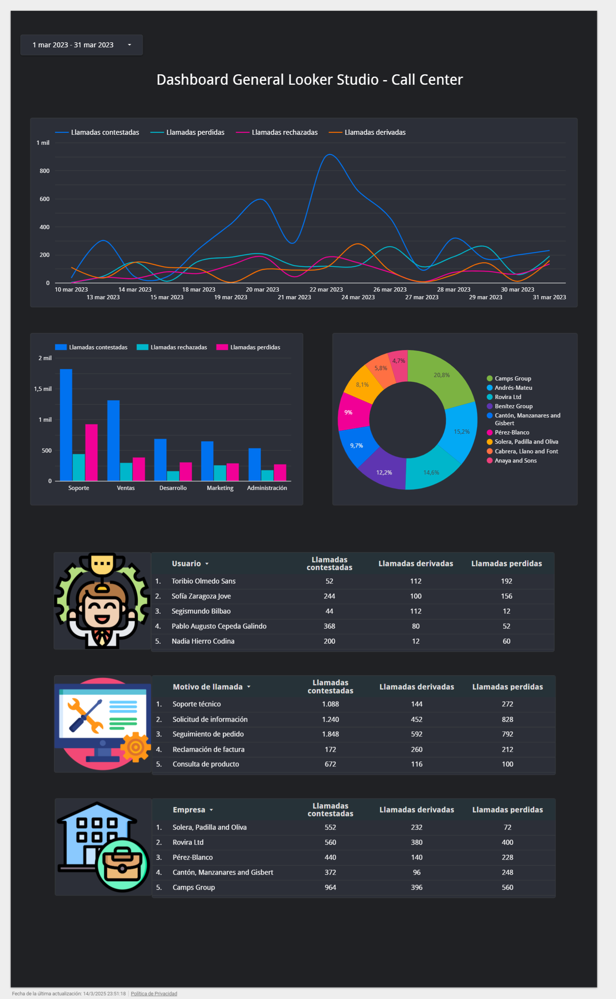

# 📞 Análisis de Llamadas - Call Center

## 📌 Descripción  
Este dashboard ofrece un **análisis detallado del rendimiento de un Call Center**, permitiendo visualizar el número de llamadas contestadas, rechazadas, derivadas y perdidas. Su objetivo es identificar **oportunidades de mejora en la gestión de llamadas**.

## DashBoard

## 🎯 Problema que Resuelve  
Muchos centros de llamadas enfrentan problemas en la gestión del tráfico de llamadas, lo que puede afectar la calidad del servicio. Este dashboard ayuda a:

- Analizar el **volumen y tipo de llamadas**.
- Identificar **departamentos con mayor tasa de llamadas perdidas**.
- Evaluar el **rendimiento de los agentes** en función de las llamadas atendidas.
- Determinar las **empresas con mayor interacción** con el Call Center.

## 🛠️ Tecnologías Utilizadas  
- **Looker Studio** 📊 (Visualización y análisis de datos)  
- **Google Sheets** 📂 (Almacenamiento de datos)

