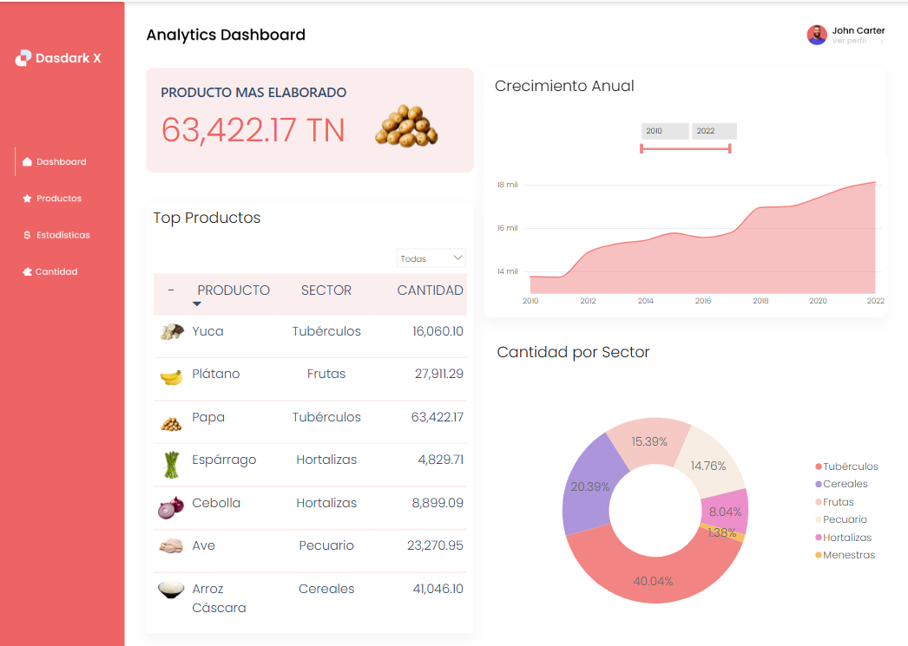

# 🍽️ Producción de Alimentos en Perú

## 📌 Descripción  
Este dashboard analiza la **producción de alimentos en Perú**, mostrando cuáles son los productos más elaborados y su distribución en distintos sectores.  

## DashBoard

## 🎯 Problema que Resuelve  
Actualmente, la información sobre la producción de alimentos en Perú no está centralizada ni visualmente accesible. Este dashboard ayuda a:

- Identificar los **alimentos más producidos** en el país.
- Analizar la **producción anual** y su evolución en el tiempo.
- Evaluar la **distribución de productos por sector**.
- Crear una base escalable para incluir nuevos datos y mejorar la visualización.

## 🛠️ Tecnologías Utilizadas  
- **Power BI** 📊 (Modelado y visualización de datos)  
- **Excel** 📂 (Gestión y procesamiento de datos)

---

## 📌 Preguntas y Respuestas Clave del Dashboard  

### 🔹 1. ¿Cuál es el producto más elaborado en Perú?  
📌 Se muestra en el dashboard la categoría **"PRODUCTO MÁS ELABORADO"**, que permite identificar cuál tiene la mayor cantidad de producción anual.

### 🔹 2. ¿Cuál es la producción total de alimentos en el último año registrado?  
📌 El KPI **CantTotal_Año** refleja la cantidad total de alimentos producidos en el último año disponible en la base de datos.

### 🔹 3. ¿Cómo se distribuyen los alimentos por sector?  
📌 A través de la columna **"Sector"**, se analiza qué tipo de alimentos predominan en diferentes sectores económicos o geográficos.

### 🔹 4. ¿Es posible ampliar la base de datos con más productos?  
📌 Sí, este modelo es **escalable**, lo que significa que pueden agregarse nuevos alimentos y sectores para mejorar la precisión y el alcance del análisis.

---

## 📌 Conclusiones y Recomendaciones  

- Se recomienda **ampliar la base de datos** con más productos para obtener un análisis más completo.  
- El dashboard permite detectar tendencias de producción y **optimizar la gestión del sector alimentario en Perú**.  
- Se pueden aplicar filtros dinámicos en Power BI para **visualizar datos por año y sector**, facilitando la exploración de información.  

